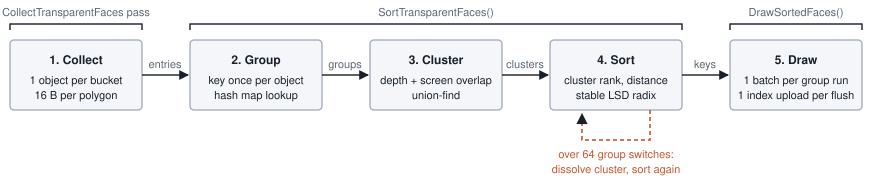
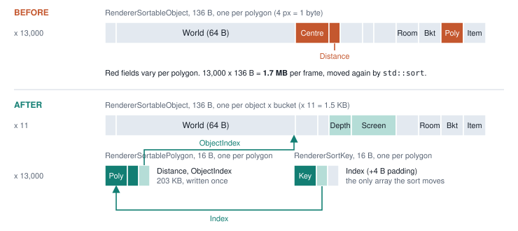
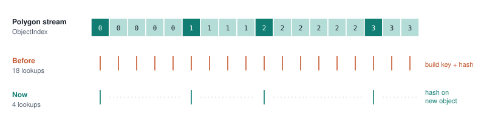
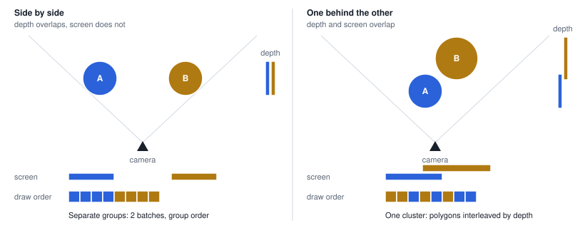
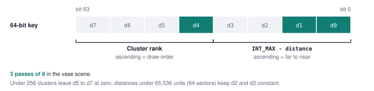
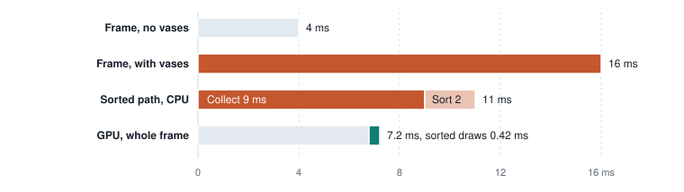

# Transparent Sorting - Design Notes

## Overview

Faces with sorted blend modes (every mode except opaque, alpha test, additive, distortion and fast
alpha blend, see `IsSortedBlendMode`) and faces of objects faded below `ALPHA_BLEND_THRESHOLD`
cannot rely on the depth buffer, so the renderer draws them back to front in a dedicated pass after
the opaque, additive and distortion passes. This document describes how that pass collects, groups, orders and
draws those faces, and why it is built this way.



| Stage | Function | File |
|-------|----------|------|
| Collect | `CollectSortedBucket`, `CollectSortedSprite`, called from every `Draw*` function in the `CollectTransparentFaces` pass | `RendererSorted.cpp`, call sites in `RendererDraw.cpp`, `RendererDrawEffect.cpp`, `RendererSprites.cpp` |
| Group, cluster, sort | `SortTransparentFaces` | `RendererSorted.cpp` |
| Draw | `DrawSortedFaces` and `Draw*Sorted` | `RendererSorted.cpp` |
| Data | `RendererSortableObject`, `RendererSortablePolygon`, `RendererSortKey` | `Structures/RendererSortableObject.h` |
| Containers | `TransparentObjectsToDraw`, `TransparentPolygonsToDraw`, `TransparentSortKeys` | `RenderView.h` |

Frame flow in `RenderScene`:

```cpp
DoRenderPass(RendererPass::CollectTransparentFaces, view, false); // Collect.
SortTransparentFaces(view);                                       // Group, cluster, sort.
DoRenderPass(RendererPass::Transparent, view, true);              // Draw (also once per mirror).
```

---

## Data Layout

The pass separates what is shared by a whole mesh bucket from what changes per polygon.



| Struct | Size | Count | Contents |
|--------|------|-------|----------|
| `RendererSortableObject` | 136 B | one per object bucket (or per sprite) | Draw state: type, world matrix, blend and light mode, room, bucket, owner pointer. Also the group index, depth range and screen rectangle used by `SortTransparentFaces`. |
| `RendererSortablePolygon` | 16 B | one per polygon | Polygon pointer, distance to camera, index of its object. Sprites use a single entry with no polygon. |
| `RendererSortKey` | 16 B | one per polygon | 64-bit sort key and index of the polygon entry. |

Only the sort key array is reordered. Objects and polygon entries stay where collection wrote them,
and `DrawSortedFaces` reaches them through `key.Index` and `polygon.ObjectIndex`.

### Collection

Every collection site fills one `RendererSortableObject` per bucket and calls:

```cpp
void CollectSortedBucket(RenderView& view, const RendererSortableObject& object, const Matrix* world, const Vector3& cameraPosition);
void CollectSortedSprite(RenderView& view, const RendererSortableObject& object, int distance);
```

`CollectSortedBucket` transforms each polygon centre by `world` (or uses it as-is for rooms, which
pass `nullptr`), stores the distance to `cameraPosition`, and grows the object's depth range and
normalized screen rectangle by projecting the centre with `view.Camera.ViewProjection`. Points
behind the camera count as covering the whole screen. The transforms are written out by hand so the
per-polygon cost stays low in debug builds too.

Per-instance work happens once per mesh, never per polygon: the bone and world matrix product for
item meshes and the `Matrix::Lerp` of swarm instances are computed before the bucket loop.

> **Note:** item meshes measure distance from `Camera.pos` (the game camera); all other object types
> use `view.Camera.WorldPosition`.

---

## Grouping

A group is the unit that can draw as one batch. Group identity is a `GroupKey` built by
`GetSortedGroupKey`:

| Object type | Key |
|-------------|-----|
| Room | bucket |
| Moveable, hair | item + bucket + object type |
| Static | static + bucket |
| Effect | effect + bucket |
| Swarm (`MoveableAsStatic`) | bucket + rounded world translation (3 x 21 bits); swarms have no stable instance pointer |
| Sprite | texture + 4-block depth band + blend mode, sprite type, render type, soft particle flag |

All polygons of one object are contiguous, so the key and its hash map lookup are resolved only when
`ObjectIndex` changes. The other polygons only add their distance to the group.



---

## Clusters

Group order alone is wrong when two transparent objects overlap: one draws entirely before the
other, regardless of which polygons are actually in front. Polygon order across objects only changes
the image when the objects overlap **both in depth and on screen**, so only those are interleaved.



1. `BuildSortedClusters` joins groups whose depth ranges and screen rectangles both overlap, using a
   union-find. Candidates are swept by near depth, so a group is only tested against groups that
   start before it ends. Rooms and sprites never join a cluster.
2. `RankSortedClusters` orders clusters with the same rules previously used for single groups:
   - rooms first, back to front by portal traversal order;
   - objects back to front by mean polygon distance, quantized to `GROUP_DEPTH_STEP` (128 units);
   - equal depth falls back to a fixed blend mode priority (issue #1793), then to the cluster id.

   A group outside any cluster is a cluster of one and keeps its previous position.
3. Inside a cluster, polygons are in exact far-to-near order, so batches break wherever the group
   changes.

`SplitBusyClusters` counts group switches inside each cluster after sorting. A cluster with more than
`MAX_CLUSTER_GROUP_SWITCHES` (64) switches is dissolved, its groups return to group order and the
keys are sorted again. This keeps a pathological overlap from turning into one draw call per
polygon; in the common case the sort runs once.

> **Limitations:** screen rectangles come from polygon centres, so a large low-polygon object (a
> two-triangle surface) has an almost point-sized rectangle and may miss an overlap. It then keeps
> group order, which is the previous behaviour. Centre-based ordering is still a painter's algorithm:
> intersecting polygons can sort wrong.

---

## Sort Key



```cpp
key = ((unsigned long long)clusterRank << 32) | (unsigned int)(INT_MAX - distance);
```

Ascending keys give clusters in draw order and polygons far to near inside each cluster.
`RadixSortKeys` is a stable LSD radix sort with 8-bit digits. It builds all eight digit histograms
in one read pass and skips every digit that is equal for all keys, so a typical scene needs three
passes. The scratch buffer `_sortKeysScratch` is kept across frames.

---

## Drawing

`DrawSortedFaces` walks the sorted keys and builds batches of consecutive polygons that share a
`GroupIndex`. Mesh batches copy their indices into `_sortedPolygonsIndices`, sprite batches build
vertices into `_sortedPolygonsVertices`. Both are uploaded with a single map per flush, and the
recorded batches are then drawn by `DrawRoomSorted`, `DrawItemSorted`, `DrawStaticSorted`,
`DrawMoveableAsStaticSorted`, `DrawEffectSorted`, `DrawHairSorted` and `DrawSpriteSorted`. When the
shared buffers reach `MAX_TRANSPARENT_VERTICES`, the accumulated batches are flushed and collection
continues into the emptied buffers.

Each `Draw*Sorted` function rebinds shaders and vertex buffers only when the object type changes,
and rebuilds the objects or room constant buffer only when the owning object changes. Swarm objects
have no stable instance pointer to compare and upload on every batch. Interleaved clusters therefore
pay one constant buffer upload per object switch.

Rooms are skipped while drawing mirrored views.

---

## Debug Overlay

The Renderer Stats debug page shows, under **SORTED draw calls**:

| Line | Meaning |
|------|---------|
| `SORTED faces` | Number of sorted polygon entries (sprites count as one). |
| `Interleaved groups` | Groups that ended up in a cluster of two or more. |
| `Collect`, `Sort`, `Draw` | CPU time of the collect pass, `SortTransparentFaces` and the transparent pass, in ms. |

---

## Background

The current design replaced a version that turned every transparent polygon into a full 136-byte
object and sorted those objects with `std::sort`. A scene with seven alpha-blended vases (about
12,600 triangles) ran a debug frame at 16 ms instead of 4 ms. A RenderDoc replay of that scene put
the whole GPU frame at 7.2 ms, with the seven sorted draws at 0.42 ms, so the cost was on the CPU.



| Step, 13,000 polygons | Debug | Release |
|-----------------------|------:|--------:|
| `std::sort` of 136-byte objects (old) | 5.3 ms | 1.1 ms |
| Radix sort of 16-byte keys | 0.5 ms | 0.07 ms |
| Collect with per-polygon objects (old) | 9 ms | - |
| Sort with per-polygon grouping (old) | 2 ms | - |

Sort timings come from a standalone benchmark; collect and sort timings come from the debug overlay.

---

## Possible Improvements

- **32-bit sort entries.** A radix sort on the 32-bit inverted distance followed by one stable
  counting-sort pass by cluster rank yields the same order with 8-byte entries. Expected gain is
  small (around 0.2 ms in debug for 13,000 polygons), since the pass count stays the same.
- **Sprites in clusters.** Interleaving sprites with meshes would fix particles seen through glass,
  but mixes the sprite and mesh batch paths. Not enabled yet.
- **Cheaper object switches.** Uploading all sorted objects to one constant buffer and selecting the
  object through an instance-rate index would make interleaved clusters almost free, and allow a
  higher switch limit.
